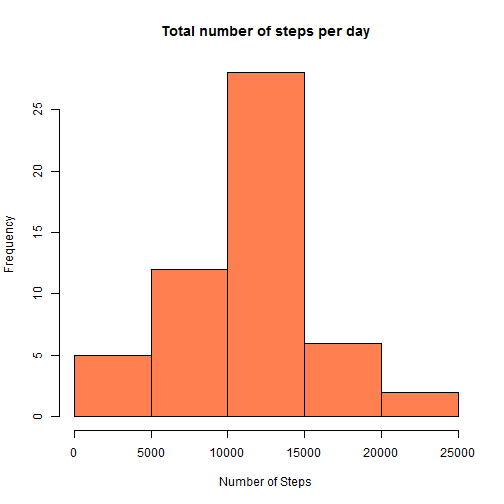
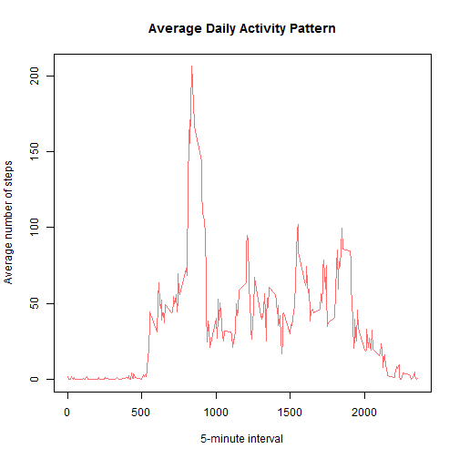
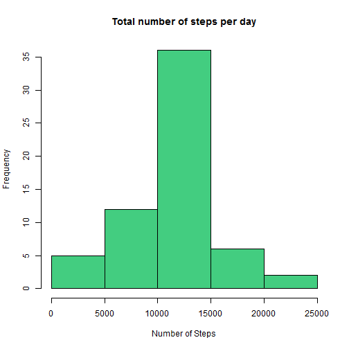
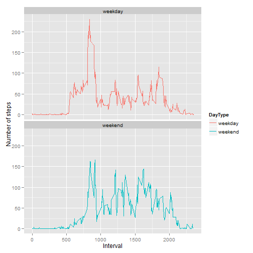

Reproducible Research: Peer Assessment 1
========================================================

This assignment makes use of data from a personal activity monitoring device. This device collects data at 5 minute intervals through out the day. The data consists of two months of data from an anonymous individual collected during the months of October and November, 2012 and include the number of steps taken in 5 minute intervals each day.

## Loading and preprocessing the data

The data is loaded into `myData` variable and the column _date_ format is changed:


```r
myData <- read.csv("activity.csv", header=TRUE, sep=",")
myData[,2] <- as.Date(myData[,2], format="%Y-%m-%d")
```

## What is mean total number of steps taken per day?

For this part of the assignment, the missing values in the dataset were ignored.


```r
myDataClean <- myData[which(myData$steps != "NA"), ]
```

#### Histogram of the total number of steps taken each day

Firstable, we sum the steps for each day with the help of the `plyr` package.


```r
library(plyr)
StepsPerDay <- ddply(myDataClean, .(date), summarize, steps=sum(steps))
```

Then, we make the histogram.


```r
hist(StepsPerDay$steps, col="coral", xlab="Number of Steps", main="Total number of steps per day")
```

 

Calculate and report the mean and median total number of steps taken per day


```r
mean(StepsPerDay$steps)
```

```
## [1] 10766
```

```r
median(StepsPerDay$steps)
```

```
## [1] 10765
```

## What is the average daily activity pattern?

First, we calculate the average number of steps taken each 5-minute interval. 


```r
StepsAveragePerInterval <- ddply(myDataClean, .(interval), summarize, steps=mean(steps))
colnames(StepsAveragePerInterval)[2] <- "StepsAvg"
```

Then, we plot it.


```r
plot(StepsAveragePerInterval$interval, StepsAveragePerInterval$StepsAvg, type = "l", col='indianred1',
     main="Average Daily Activity Pattern", xlab="5-minute interval", ylab="Average number of steps")
```

 

#### Which 5-minute interval, on average across all the days in the dataset, contains the maximum number of steps?


```r
StepsAveragePerInterval[StepsAveragePerInterval$StepsAvg==max(StepsAveragePerInterval$StepsAvg),]
```

```
##     interval StepsAvg
## 104      835    206.2
```

## Imputing missing values
- Calculate and report the total number of missing values in the dataset (i.e. the total number of rows with NAs)


```r
sum(is.na(myData$steps))
```

```
## [1] 2304
```

- Devise a strategy for filling in all of the missing values in the dataset. The strategy does not need to be sophisticated. For example, you could use the mean/median for that day, or the mean for that 5-minute interval, etc.

Considering that we already calculate the average number of steps taken each 5-minute interval, we are going to use this value for filling in all the missing values in the dataset.

- Create a new dataset that is equal to the original dataset but with the missing data filled in.

```r
fillData <- join(myData, StepsAveragePerInterval, by="interval", type="left")

fillData$steps[is.na(fillData$steps)] <- fillData$StepsAvg[is.na(fillData$steps)]
```

- Make a histogram of the total number of steps taken each day and calculate and report the mean and median total number of steps taken per day.


```r
NewStepsPerDay <- ddply(fillData, .(date), summarize, steps=sum(steps))
hist(NewStepsPerDay$steps, col="seagreen3", xlab="Number of Steps", main="Total number of steps per day")
```

 

```r
mean(NewStepsPerDay$steps)
```

```
## [1] 10766
```

```r
median(NewStepsPerDay$steps)
```

```
## [1] 10766
```

- Do these values differ from the estimates from the first part of the assignment? What is the impact of imputing missing data on the estimates of the total daily number of steps?

The impact of imputing missing data is that the total number of steps increase. But because the values filled were average numbers the mean value didn´t change. The behavior of the histogram remains.

## Are there differences in activity patterns between weekdays and weekends?
For this part we use the weekdays() function and the dataset with the filled-in missing values.

- Create a new factor variable in the dataset with two levels - "weekday" and "weekend" indicating whether a given date is a weekday or weekend day.


```r
weekData <- fillData
weekData["weekday"] <- weekdays(fillData$date)
weekData["DayType"] <- ifelse(weekData$weekday %in% c("Saturday", "Sunday"),"weekend", "weekday")
```

- Make a panel plot containing a time series plot (i.e. `type = "l"`) of the 5-minute interval (x-axis) and the average number of steps taken, averaged across all weekday days or weekend days (y-axis).


```r
StepsPerDayWK <- ddply(weekData, .(interval, DayType), summarize, steps=mean(steps))

library(ggplot2)
qplot(interval, steps, data = StepsPerDayWK, geom="line", color = DayType,
      xlab="Interval", ylab="Number of steps") + facet_wrap(~ DayType, nrow=2)
```

 

